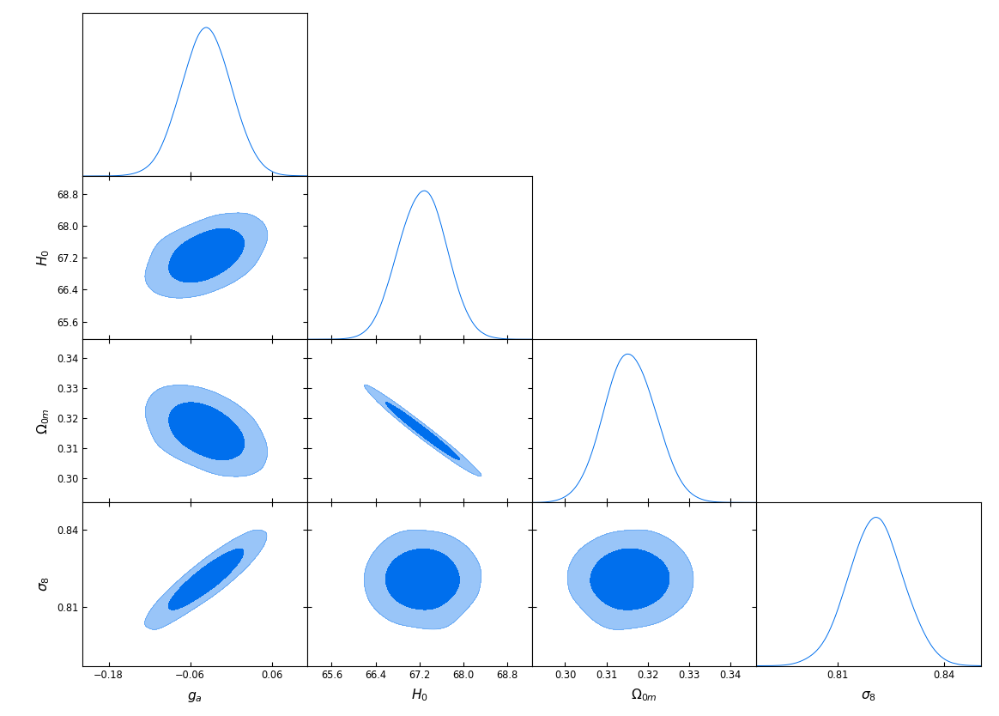

# Is Gravity Getting Weaker at Low z? Observational Evidence and Theoretical Implications
<p align="center">

</p>

This is the repository that contains the codes as well as useful comments that reproduce the figures of [arxiv:1907.03176](https://arxiv.org/pdf/1907.03176.pdf). The Mathematica code [weaker_gravity](weaker_gravity.zip) (in .zip format) reproduces figures 3-9 as well as figure 12.

The folders [MGCAMB-eff_newt_const](MGCAMB-eff_newt_const.zip) and [MGCosmoMC-eff_newt_const](MGCosmoMC-eff_newt_const.zip) contain only
the modified files of MGCAMB 2019 and MGCOSMOMC 2019 packages in order to reproduce figures 10 and 11 respectively.

## Abstract
Dynamical observational probes of the growth of density perturbations indicate that gravity may be getting weaker at low redshifts z. This evidence is at about 2-3&sigma; level and comes mainly from weak lensing data that measure the parameter <a href="https://www.codecogs.com/eqnedit.php?latex=S_8=\sigma_8&space;\sqrt{\Omega_{0m}/0.3}" target="_blank"></a>  and redshift space distortion data that measure the growth rate times the amplitude of the linear power spectrum parameter f&sigma;<sub>8</sub>(z).  The measured f&sigma;<sub>8</sub>(z) appears to be lower than the prediction of General Relativity (GR) in the context of the standard &Lambda;CDM model as defined by the Planck best fit parameter values. This is the well known f&sigma;<sub>8</sub> tension of &Lambda;CDM, which constitutes one of the two main large scale challenges of the model along with the H<sub>0</sub> tension.  We review the observational evidence that leads to the f&sigma;<sub>8</sub> tension and discuss some theoretical implications. If this tension is not a systematic effect it may be an early hint of modified gravity with an evolving effective Newton's constant G<sub>eff</sub> and gravitational slip parameter &eta;. We discuss such best fit parametrizations of G<sub>eff</sub> and point out that they can not be reproduced by simple scalar-tensor and f(R) modified gravity theories because these theories generically predict stronger gravity  than General Relativity (GR) at low z in the context of a &Lambda;CDM background H(z). Finally, we show weak evidence for an evolving reduced absolute magnitude of the SnIa of the Pantheon dataset at low redshifts (<a href="https://www.codecogs.com/eqnedit.php?latex=z<0.1" target="_blank"></a>) which may also be explained by a reduced strength of gravity and may help resolve the H<sub>0</sub> tension.

## Instructions

* Install the [MGCAMB](https://github.com/sfu-cosmo/MGCAMB/tree/eff_newt_const) and [MGCOSMOMC](https://github.com/sfu-cosmo/MGCosmoMC/tree/eff_newt_const) 
packages as it is decribed in the official repositories.

* Substitute the appropriate files with the corresponding ones inside the folders [MGCAMB-eff_newt_const](MGCAMB-eff_newt_const.zip)
and [MGCosmoMC-eff_newt_const](MGCosmoMC-eff_newt_const.zip)

* Run on your terminal: 
```bash
make clean
make
```
which compile the MGCAMB and MGCOSMOMC packages. Wait until everything is finished. After that you are good to go!

* Concerning the [MGCAMB](https://github.com/sfu-cosmo/MGCAMB/tree/eff_newt_const) package the main modifications were performed in 
the ```params_CMB_MG.ini``` files. For each pair of <a href="https://www.codecogs.com/eqnedit.php?latex=(g_a,n)" target="_blank"></a> a separate file was created (e.g. the file ```params_MG_ga05.ini``` corresponds to g<sub>&alpha;</sub>=0.5 and n=2).

* Concerning the [MGCOSMOMC](https://github.com/sfu-cosmo/MGCosmoMC/tree/eff_newt_const) package the priors of g<sub>&alpha;</sub> and n can be found in 
```batch3/params_CMB_MG.ini``` file, while the priors for the rest of the parameters can be found in 
```batch3/params_CMB_defaults.ini``` file.


## Citing the paper 
If you use any of the above codes or the figures in a published work please cite the following paper:
<br>*Is Gravity Getting Weaker at Low z? Observational Evidence and Theoretical Implications.*
<br>Lavrentios Kazantzidis, Leandros Perivolaropoulos, [arxiv:1907.03176](https://arxiv.org/pdf/1907.03176.pdf)
<br>as well as the appropriate papers described in the offficial [MGCAMB](https://github.com/sfu-cosmo/MGCAMB/tree/eff_newt_const) and [MGCOSMOMC](https://github.com/sfu-cosmo/MGCosmoMC/tree/eff_newt_const) repositories.

Any further questions/comments are welcome

## Authors List
Lavrentios Kazantzidis - <lkazantzi@cc.uoi.gr>
<br>Leandros Perivolaropoulos - <leandros@uoi.gr>
